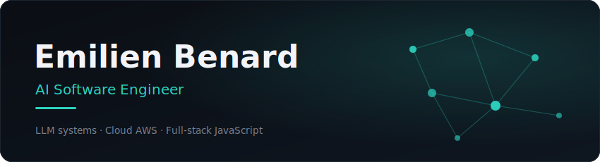

  

## 01 . Qui je suis

Ingénieur logiciel spécialisé en **Agentic AI** et **architectures cloud AWS**. Issu d'un parcours initial en 3D/VFX, j'allie une forte sensibilité produit et UX à l'ingénierie logicielle pour concevoir et industrialiser des systèmes autonomes résilients en production.

Ce qui me passionne, c'est le point de rencontre entre les modèles de pointe et l'ingénierie logicielle qui les entoure : orchestration avancée, serveurs MCP (Model Context Protocol) sur mesure, mémoire vectorielle et infrastructures cloud hautement disponibles. 

Actuellement **AI Software Engineer & Référent interne IA/MCP chez Amiltone**.

---

## 02 . Ce que je construis (Featured Projects)

| Projet | Description & Architecture | Stack Technique |
| :--- | :--- | :--- |
| **Agentic OS**  *(Tessera & Cortex)* | Écosystème R&D d'agents IA autonomes. **Tessera** orchestre la collaboration multi-LLM locale/cloud. **Cortex** gère la mémoire à long terme via un système de RAG s'appuyant sur un graphe de connaissances temporel. | TypeScript, Bun, Tauri, MCP SDK, PostgreSQL (`pgvector`), OpenAI/Anthropic APIs |
| **Cocktails Di Jo**  *Projet de titre CDA* | Plateforme e-commerce full-stack intégrant un **agent IA conversationnel doté d'une Generative UI** (via Amazon Bedrock) pour la prise de commande dynamique et la recommandation contextuelle sécurisée. | NestJS, React, Vite, AWS Bedrock, Lambda, GitHub Actions, Stripe |

---

## 03 . Expertise Technique

* **AI & Orchestration :** MCP SDK ∙ CrewAI ∙ Orca (ADE) ∙ FastMCP
* **AI Integrations :** Anthropic API ∙ OpenAI API ∙ Function Calling ∙ Prompt Engineering
* **Cloud AWS :** Amazon Bedrock ∙ Lambda ∙ EC2 ∙ API Gateway ∙ SSM
* **Languages :** Python ∙ TypeScript / JavaScript (Bun ∙ Node.js ∙ NestJS)
* **Data & Vector :** PostgreSQL (pgvector) ∙ Knowledge Graphs ∙ Graphes Temporels
* **DevOps :** CI/CD (GitHub Actions) ∙ Docker ∙ Git ∙ GitLab CI

---

## 04 . Activité

  

---

## 05 . Me joindre

* **LinkedIn** : [/emilien-benard](https://www.linkedin.com/in/emilien-benard)
* **Email** : [emilien.benard2@gmail.com](mailto:emilien.benard2@gmail.com)